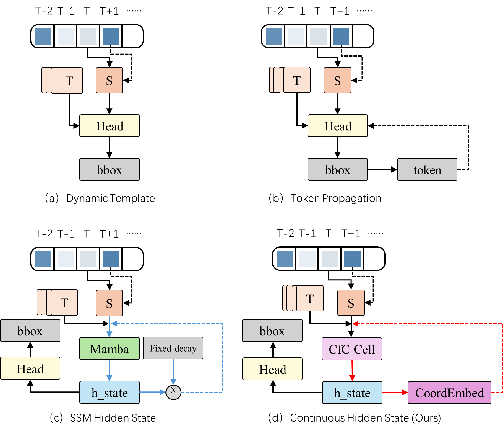
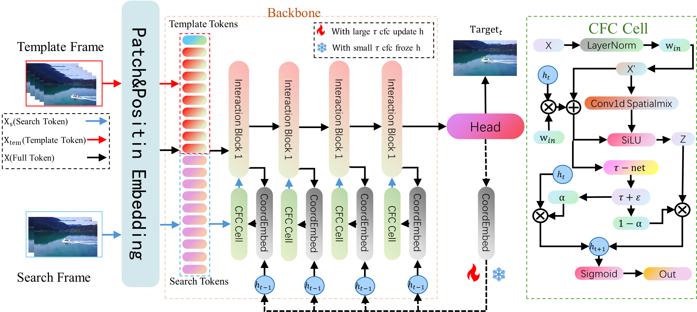

# MCLTrack

Official PyTorch implementation of MCLTrack.

## Resources

- [Raw results (Baidu Netdisk)](https://pan.baidu.com/s/18v0BkousSLSZfqRbbW9SMw?pwd=mcal)
- [Checkpoints (Baidu Netdisk)](https://pan.baidu.com/s/1DYKBTVIMBBiKqIBcBjXwZA?pwd=mcal) (code: `mcal`)
- [Pretrained weights (Google Drive)](https://drive.google.com/drive/folders/1qDAMcU3JpahV7MriEOl4KfjKvAAFXd3E?usp=sharing)

## Highlights

### Contextual information propagation
MCLTrack uses hidden states to propagate richer contextual information across frames efficiently.



### Simple architecture
MCLTrack consists of a backbone, a contextual information fusion module, and a prediction head.



### Performance

#### Comparison with released checkpoints
| Tracker           | LaSOT (AUC) | LaSOT_ext (AUC) | TrackingNet (AUC) | GOT10K (AO) |
|-------------------|-------------|-----------------|-------------------|-------------|
| **MCLTrack-L224** | **75.3**    | **51.5**        | **85.0**          | **77.0**    |
| MCLTrack-B224     | 74.8        | 50.9            | 83.7              | 75.1        |
| MCLTrack-S224     | 73.9        | 50.5            | 84.1              | 74.7        |

#### Detailed benchmark results
| Tracker | GOT10K (AO) | GOT10K (SR0.5) | GOT10K (SR0.75) | LaSOT (AUC) | LaSOT P<sub>N</sub> | LaSOT (P) | LaSOT-ext (AUC) | LaSOT-ext P<sub>N</sub> | LaSOT-ext (P) | TrackingNet (AUC) | TrackingNet P<sub>N</sub> | TrackingNet (P) |
|---------|-------------|----------------|-----------------|-------------|---------------------|-----------|------------------|-------------------------|---------------|-------------------|--------------------------|-----------------|
| MCLTrack-S224 | 74.7 | 84.4 | 74.4 | 73.9 | 89.8 | 88.6 | 50.5 | 59.3 | 56.0 | 84.1 | 89.4 | 84.4 |
| MCLTrack-B224 | 75.1 | 85.6 | 74.5 | 74.8 | 91.3 | 88.8 | 50.9 | 60.1 | 56.7 | 83.7 | 89.8 | 84.1 |
| MCLTrack-L224 | 77.0 | 86.6 | 78.2 | 75.3 | 89.5 | 88.0 | 51.5 | 61.4 | 57.4 | 85.0 | 90.3 | 85.1 |

## Environment setup

```bash
conda create -n mcltrack python=3.11
conda activate mcltrack
pip install -r requirements.txt
```

Install a PyTorch build that matches your CUDA environment before or after the command above if needed.

Add the project root to `PYTHONPATH`.

```bash
# Linux / macOS
export PYTHONPATH=/path/to/MCLTrack-main:$PYTHONPATH
```

```powershell
# Windows PowerShell
$env:PYTHONPATH = "D:\MCLTrack-main;$env:PYTHONPATH"
```

## Data preparation

Place datasets under `./data` so the structure looks like:

```text
${MCLTrack_ROOT}
├── data
│   ├── lasot
│   ├── got10k
│   │   ├── test
│   │   ├── train
│   │   └── val
│   ├── coco
│   │   ├── annotations
│   │   └── images
│   ├── trackingnet
│   │   ├── TRAIN_0
│   │   ├── TRAIN_1
│   │   ├── ...
│   │   ├── TRAIN_11
│   │   └── TEST
│   └── vasttrack
```

## Set local paths

Generate local path config files before training or evaluation:

```bash
python tracking/create_default_local_file.py --workspace_dir . --data_dir ./data --save_dir .
```

You can then edit these files if needed:

- `lib/train/admin/local.py`
- `lib/test/evaluation/local.py`

## Training

Download pretrained weights and place them under `./pretrained`.

The public release uses the `mcltrack_*` config names under `experiments/mcltrack/`. These public config names now point to the MCAL-based MCLTrack settings.
Recommended starting points:

- `mcltrack_b224`
- `mcltrack_s224`
- `mcltrack_t224`
- `mcltrack_l224`
- `mcltrack_l384`

Example:

```bash
torchrun --nproc_per_node 8 lib/train/run_training.py --script mcltrack --config mcltrack_b224 --save_dir .
```

## Evaluation

### Direct test with released checkpoints

Download the released checkpoints from Baidu Netdisk and place them under `./checkpoints/train/mcltrack/<config_name>/`.

- Link: https://pan.baidu.com/s/1DYKBTVIMBBiKqIBcBjXwZA?pwd=mcal
- Code: `mcal`

Recommended layout:

```text
${MCLTrack_ROOT}
├── checkpoints
│   └── train
│       └── mcltrack
│           ├── mcltrack_b224
│           │   └── MCLTrack_b224.pth.tar
│           ├── mcltrack_s224
│           │   └── MCLTrack_s224.pth.tar
│           └── mcltrack_l224
│               └── MCLTrack_l224.pth.tar
```

The test loader also keeps compatibility with training-produced epoch checkpoints such as `MCLTrack_ep0030.pth.tar` in the same config directory.

Quick start example:

```bash
python tracking/test.py mcltrack mcltrack_b224 --dataset_name lasot --threads 2
python tracking/analysis_results.py
```

Tracking results are written to `./output/test/tracking_results/mcltrack/<config_name>/`.

Named release weights can be placed like this:

- `./checkpoints/train/mcltrack/mcltrack_b224/MCLTrack_b224.pth.tar`
- `./checkpoints/train/mcltrack/mcltrack_s224/MCLTrack_s224.pth.tar`
- `./checkpoints/train/mcltrack/mcltrack_l224/MCLTrack_l224.pth.tar`

### LaSOT
```bash
python tracking/test.py mcltrack mcltrack_b224 --dataset_name lasot --threads 2
python tracking/analysis_results.py
```

### LaSOT_ext
```bash
python tracking/test.py mcltrack mcltrack_b224 --dataset_name lasot_extension_subset --threads 2
python tracking/analysis_results.py
```

### GOT10K-test
```bash
python tracking/test.py mcltrack mcltrack_b224_got --dataset_name got10k_test --threads 2
python lib/test/utils/transform_got10k.py --tracker_name mcltrack --cfg_name mcltrack_b224_got
```

### TrackingNet
```bash
python tracking/test.py mcltrack mcltrack_b224 --dataset_name trackingnet --threads 2
python lib/test/utils/transform_trackingnet.py --tracker_name mcltrack --cfg_name mcltrack_b224
```

### TNL2K
```bash
python tracking/test.py mcltrack mcltrack_b224 --dataset_name tnl2k --threads 2
python tracking/analysis_results.py
```

### UAV123
```bash
python tracking/test.py mcltrack mcltrack_b224 --dataset_name uav --threads 2
python tracking/analysis_results.py
```

### NFS
```bash
python tracking/test.py mcltrack mcltrack_b224 --dataset_name nfs --threads 2
python tracking/analysis_results.py
```

## Profiling

Install `thop` if it is not already available in your environment.

```bash
python tracking/profile_model.py --script mcltrack --config mcltrack_b224
```

## Model zoo

Released checkpoints:

- `mcltrack_s224` → `MCLTrack_s224.pth.tar`
- `mcltrack_b224` → `MCLTrack_b224.pth.tar`
- `mcltrack_l224` → `MCLTrack_l224.pth.tar`

| Variant | GOT10K AO | GOT10K SR0.5 | GOT10K SR0.75 | LaSOT AUC | LaSOT P<sub>N</sub> | LaSOT P | LaSOT-ext AUC | LaSOT-ext P<sub>N</sub> | LaSOT-ext P | TrackingNet AUC | TrackingNet P<sub>N</sub> | TrackingNet P | Config |
|---------|-----------|---------------|----------------|-----------|---------------------|---------|----------------|-------------------------|--------------|-----------------|--------------------------|---------------|--------|
| MCLTrack-S224 | 74.7 | 84.4 | 74.4 | 73.9 | 89.8 | 88.6 | 50.5 | 59.3 | 56.0 | 84.1 | 89.4 | 84.4 | [mcltrack_s224](experiments/mcltrack/mcltrack_s224.yaml) |
| MCLTrack-B224 | 75.1 | 85.6 | 74.5 | 74.8 | 91.3 | 88.8 | 50.9 | 60.1 | 56.7 | 83.7 | 89.8 | 84.1 | [mcltrack_b224](experiments/mcltrack/mcltrack_b224.yaml) |
| MCLTrack-L224 | 77.0 | 86.6 | 78.2 | 75.3 | 89.5 | 88.0 | 51.5 | 61.4 | 57.4 | 85.0 | 90.3 | 85.1 | [mcltrack_l224](experiments/mcltrack/mcltrack_l224.yaml) |

## Contact

-  Xuanling Feng: fengxuanling22@nudt.edu.cn

## Acknowledgments

This project builds on the excellent [OSTrack](https://github.com/botaoye/OSTrack) framework. We thank the authors for providing a strong foundation for visual object tracking research.
